### Git Assignment 

**Project Setup - Git init**

**Created README.md**

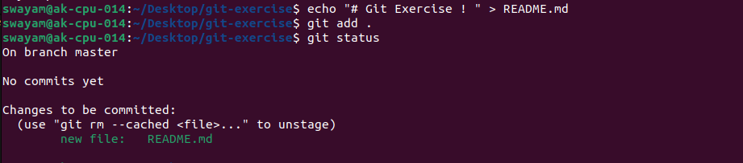

**Installing Git Flow using sudo command**

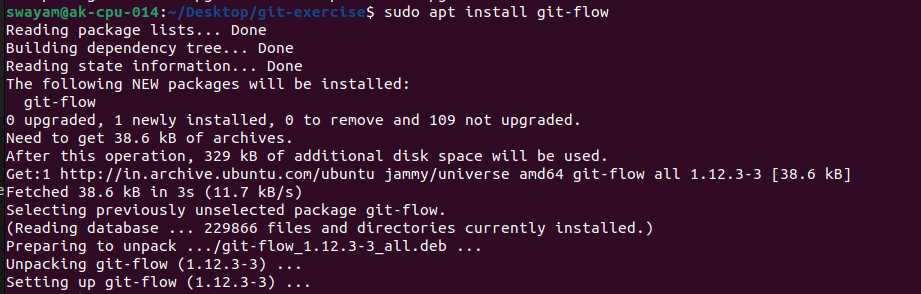

**Initializing Git Flow and Checking Version**

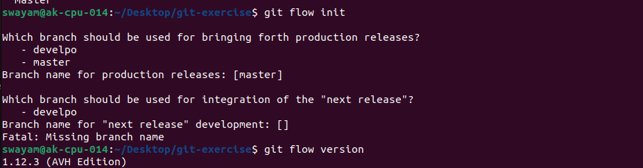

**Create Develop Branch**

**Creating two beanches project_setup and project_setup_sub**

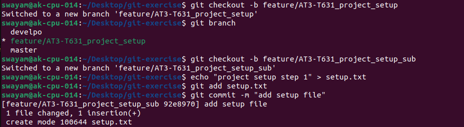

**Making 3 commits in the setup.txt**

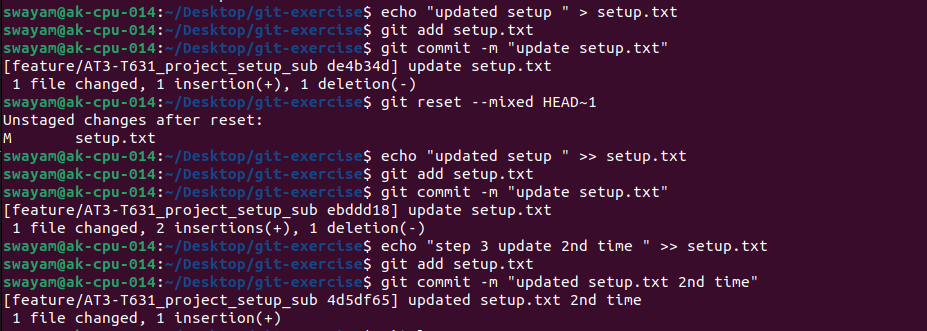

**Logging Commits**

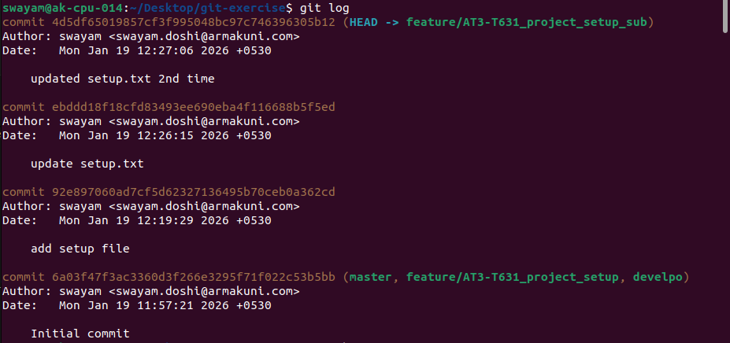

**Rebasing and checking the Logs**

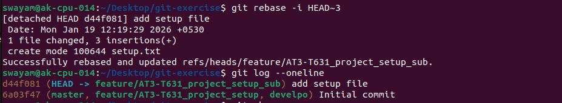

**Setting up and testing Hooks**

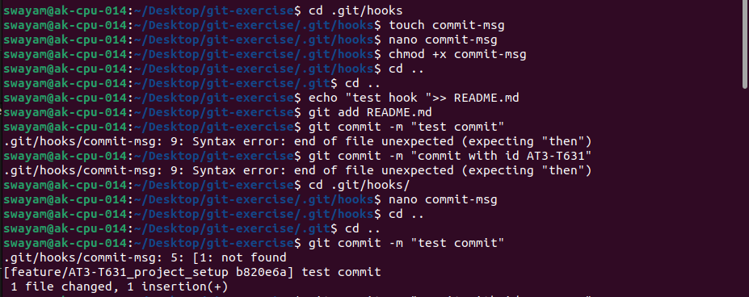

**Creating a new branch feature/AT3-T631_project_setup**

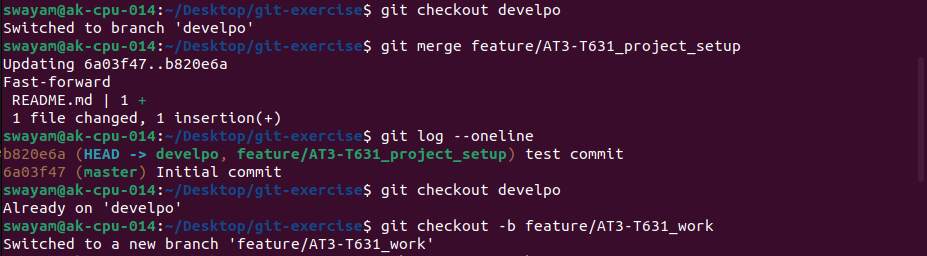

**Merging and checking log**

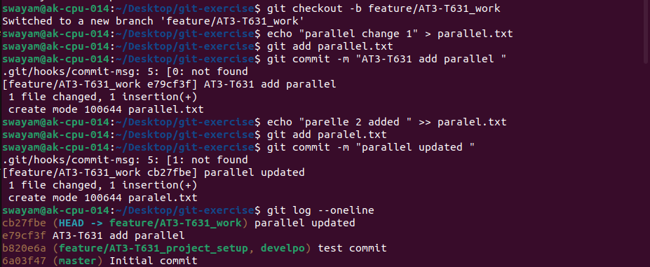

**Creating a new branch feature/AT3-T631_work with parallel.txt**

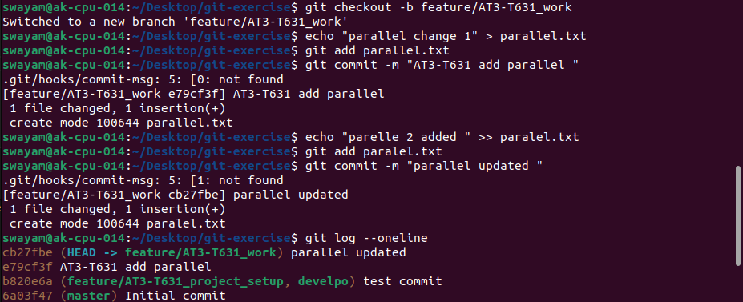

**Setting up git remote**

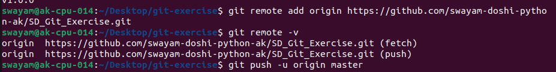

**pushing the commits**

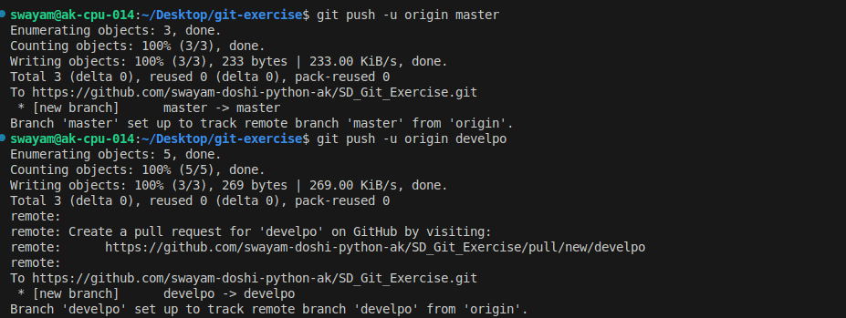

**Creating a PullRequest and merging it**

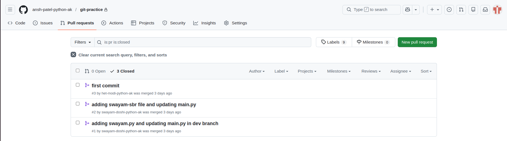

**Checking all Branches**

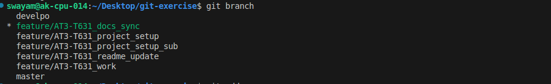

**Cleaning up Deleting the feature beanch from github gui and local git**

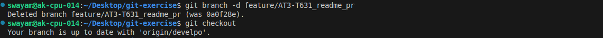

**Checking all the branches to conform delet**

